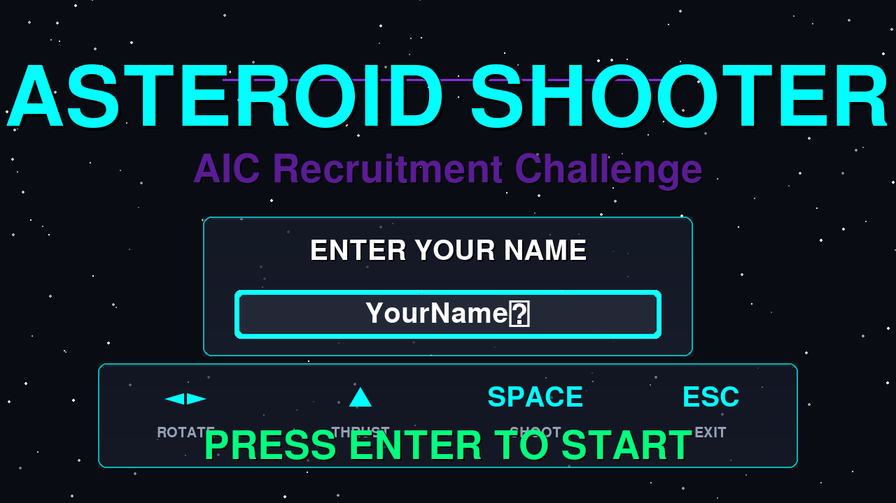
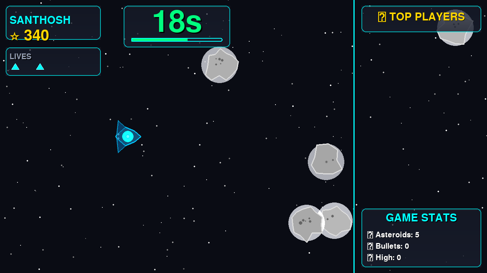
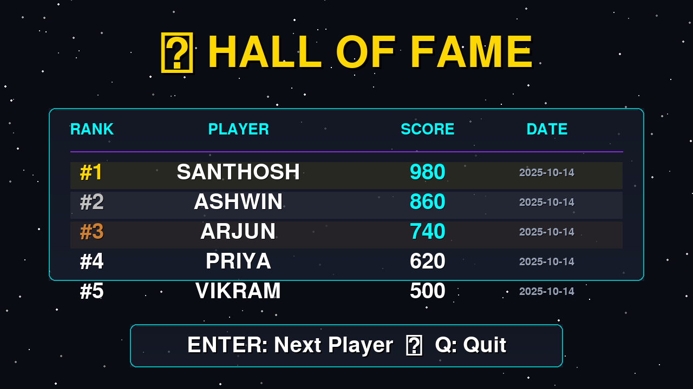

# 🚀 Asteroid Shooter

> A fast-paced, arcade-style space shooter built with Python & Pygame — battle waves of asteroids, chase the high score, and claim the top spot on the leaderboard.

---

## ✨ About the Game

**Asteroid Shooter** is a polished, event-ready arcade game built for live events and competitions. Players pilot a sleek futuristic spaceship through an infinite asteroid field, blasting rocks for points under a 30-second time limit. Every run ends with a rank on the persistent leaderboard — perfect for head-to-head competition at booths and expos.

The game was designed and used as the centrepiece challenge at the **Artificial Intelligence Club (AIC) Recruitment Drive** at **VIT Chennai**, featured across **4 editions of Club Expo**.

---

## 🎮 Gameplay

| Mechanic | Detail |
|---|---|
| **Goal** | Destroy as many asteroids as possible before time runs out |
| **Time Limit** | 30 seconds per run |
| **Lives** | 3 lives — asteroid collision costs one life |
| **Asteroids** | Three sizes: Large → Medium → Small (splits on destroy) |
| **Scoring** | Large: 20 pts · Medium: 50 pts · Small: 100 pts |
| **Leaderboard** | Persistent JSON leaderboard, ranked across all players |

---

## 🕹️ Controls

| Key | Action |
|---|---|
| `←` / `→` | Rotate ship |
| `↑` | Thrust forward |
| `Space` | Shoot |
| `Enter` | Confirm / Continue |
| `Q` | Quit (on leaderboard screen) |
| `Esc` | Exit game |

---

## 🌟 Features

- **Animated starfield** with parallax scrolling
- **Futuristic spaceship** with cockpit glow, wing geometry, and dual engine flame effects
- **Asteroid physics** — craters, glow pulse, rotation, and multi-size splitting
- **Particle effects** on explosions, bullet impacts, and thrust
- **Glass-panel HUD** showing score, timer, lives, and live leaderboard
- **Sound effects** — shoot, thrust, hit, explosion, game over
- **Persistent leaderboard** saved to JSON with timestamps and rank display
- **Web build support** via [pygbag](https://github.com/pygame-web/pygbag) — runs in the browser

---

## 📸 Screenshots

| Start Screen | Gameplay | Leaderboard |
|:---:|:---:|:---:|
|  |  |  |
| *Enter your name and launch* | *30 seconds. No mercy.* | *Hall of Fame* |

---

## ⚙️ Installation & Running

### Requirements

- Python 3.9+
- pygame

### Quick Start

```bash
# 1. Clone the repository
git clone https://github.com/santhosh-zeta/aesteroid-game.git
cd aesteroid-game

# 2. Install dependencies
pip install -r requirements.txt

# 3. Run the game
python main.py
```

### Web Build (browser play)

```bash
pip install pygbag
pygbag --build main.py
# Open build/web/index.html in a browser
```

Or simply run the included build script:

```bash
bash build.sh
```

---

## 📁 Project Structure

```
aesteroid-game/
├── main.py              # Game loop, screens, HUD
├── player.py            # Ship movement, drawing, thrust particles
├── asteroid.py          # Asteroid logic, splitting, AsteroidManager
├── bullet.py            # Bullet class
├── bullet_manager.py    # Bullet pool management
├── explosion.py         # Explosion particle system
├── leaderboard.py       # Score storage and ranking (JSON)
├── sounds.py            # Sound loading and playback
├── leaderboard.json     # Persistent score data
├── build.sh             # pygbag web build script
├── game/
│   └── settings.py      # Game constants and tuning values
└── assets/
    ├── sounds/              # .wav sound effects
    │   ├── shoot.wav
    │   ├── hit.wav
    │   ├── thrust.wav
    │   ├── explosion.wav
    │   └── game_over.wav
    └── screenshots/         # In-game screenshots
        ├── start_screen.png
        ├── gameplay.png
        └── leaderboard.png
```

---

## 🏆 Event History

Used at **VIT Chennai** as the main attraction challenge for the **Artificial Intelligence Club**:

| # | Event | Venue | Outcome |
|---|---|---|---|
| 1 | Club Expo — AIC Recruitment | VIT Chennai | Live competition with live leaderboard |
| 2 | Club Expo — AIC Recruitment | VIT Chennai | Multiple rounds, dozens of participants |
| 3 | Club Expo — AIC Recruitment | VIT Chennai | High-score challenge format |
| 4 | Club Expo — AIC Recruitment | VIT Chennai | Final edition, highest engagement |

---

## 👥 Authors

| Author | GitHub | Email |
|---|---|---|
| **Santhosh S** | [@Santhosh-Zeta](https://github.com/Santhosh-Zeta) | iamsanthosh2425@gmail.com |
| **Ashwin** | [@Ashprogrammer07](https://github.com/Ashprogrammer07) | ashprogrammer01@gmail.com |

---

## 📄 License

This project is open source. Feel free to fork, play, and build on it.

---

*Built with Python · Pygame · ❤️ at VIT Chennai*
